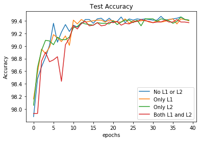
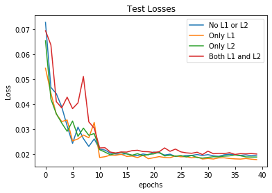
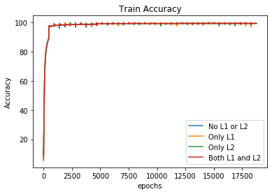
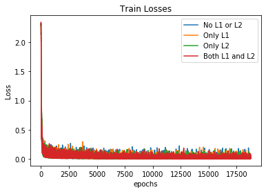
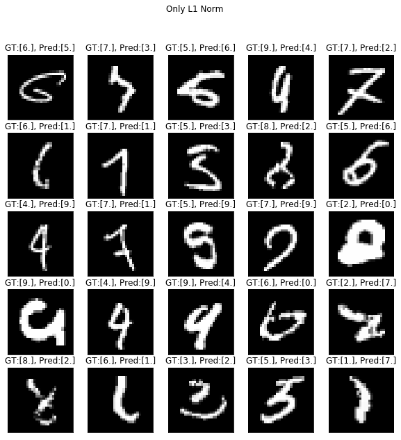
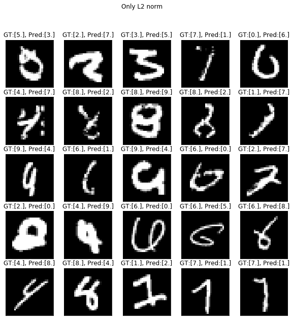
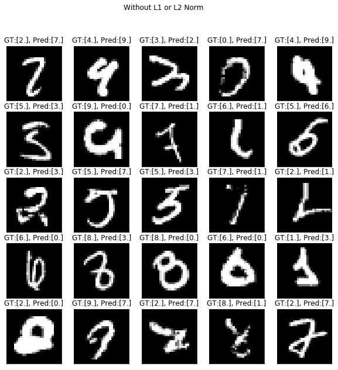
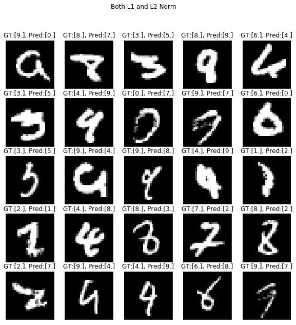

Model from last assignment ran for 40 epochs each in below scenarios

  - without L1/L2 norm
  - with L1 norm
  - with L2 norm
  - with L1 and L2 norm

#### Below are the history plots for model

#### misclassified images

---

---

---

---

#### Based on the plots
We can see that for this model, any Regularization not required.

L1 or L2 norm are added as a Regularization parameter, but the model seems to be fluctuating at same plateau with train accuracy not increasing. Implying that this model is only already fit without regularization and that **L1 or L2 norm doesn't seem to have any impact on this particular model.** We can see the impact when we have huge difference in training and test acc/loss.

#### Based on the misclassified images

 We can see that the model can benefit from below augmentations
- slight rotation
- slight shear
